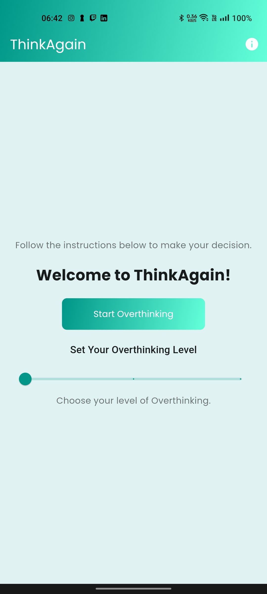
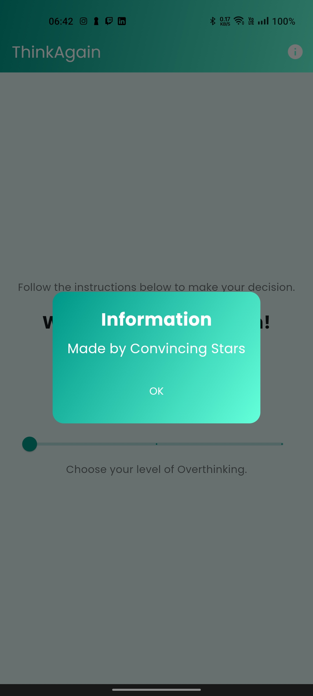
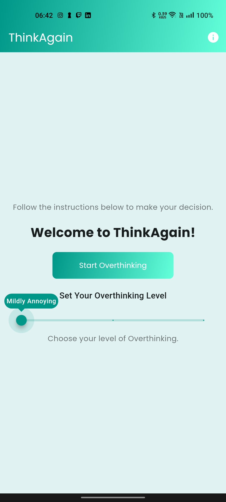
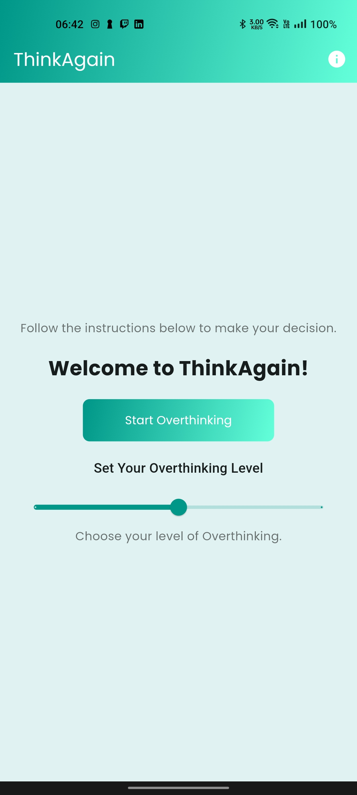
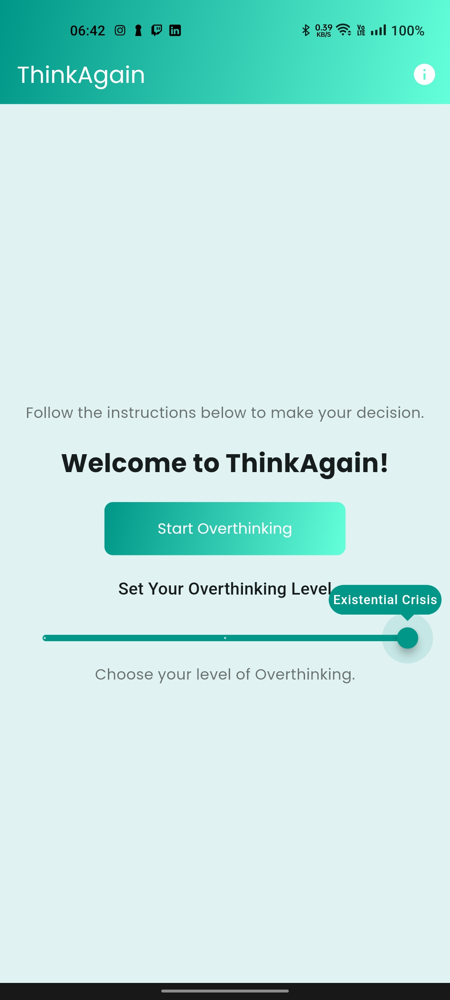
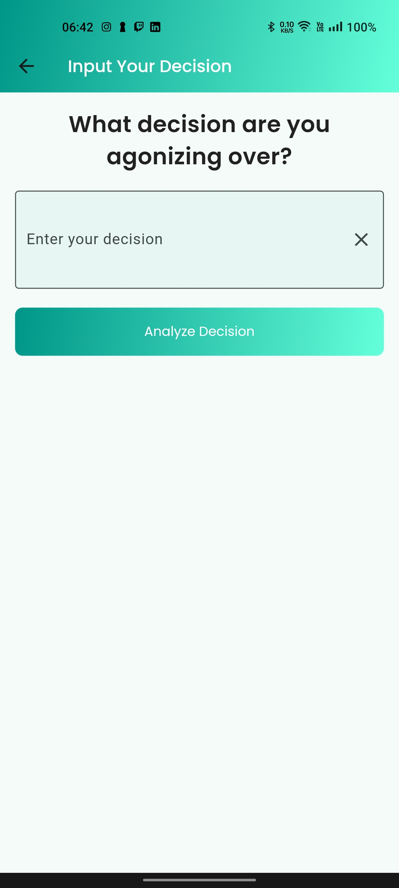
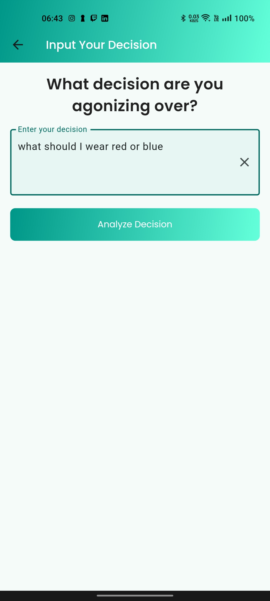
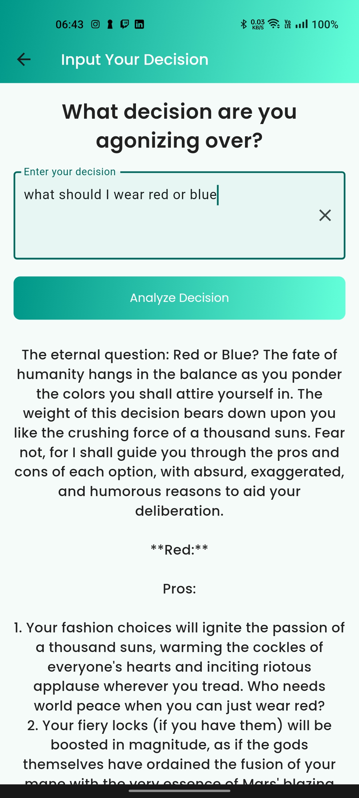

# ThinkAgain 🎯

## Basic Details
### Team Name: Convincing Stars

### Team Members
- Team Lead: Anwin Antony - SSET
- Member 2: Fahim M Faizal - SSET
- Member 3: Karthik S - SSET

### Project Description
ThinkAgain is the ultimate app for anyone who feels that their decisions are just too simple and could use a lot more unnecessary complexity. Designed to turn minor, everyday choices into epic internal struggles, ThinkAgain brings the world of overthinking to your fingertips. Whether you’re debating what shirt to wear or which snack to pick, ThinkAgain takes your decisions and transforms them into full-blown, life-altering predicaments with intricate pros and cons, hypothetical scenarios, and plenty of second-guessing encouragement.

### The Problem (that doesn't exist)
People are forced to make quick choices, missing out on the joy of overthinking every little detail. For the chronic overthinker, there’s no tool to turn tiny decisions into epic dilemmas—until now.
### The Solution (that nobody asked for)
ThinkAgain makes every tiny decision feel monumental by adding wild “what-ifs,” endless pros and cons, and last-minute curveballs. It’s designed to keep you overthinking forever—because why decide when you can endlessly doubt?
## Technical Details
### Technologies/Components Used
**Languages Used:**

-Dart – Powers the front-end logic.

-JavaScript (Node.js) – Handles backend operations and manages server-side interactions with the model.

**Frameworks Used:**

-LLaMA (3B-8B-8192) – Deployed on the server for language model processing, with access managed via an API key from Groq.

-Flutter – Provides the responsive and interactive user interface.

**Libraries Used:**

-Google Fonts – Ensures consistent and attractive typography across the UI.

-HTTP Client – Manages secure and efficient network requests between the frontend and backend.

**Tools Used:**

-VS Code and Android Studio – Primary development environments for efficient coding, testing, and debugging.

**Hosting:**

-The backend server is deployed on Render for scalable and reliable performance.
### Implementation

This project is developed using Dart for front-end logic and Node.js for the backend, where LLaMA (3B-8B-8192) is hosted and executed to handle language processing tasks. The Flutter framework drives the UI for a seamless, responsive experience. The application interacts with the model using an API key from Groq to enable secure access. Key libraries, including Google Fonts for typography and HTTP Client for handling network requests, further enhance the experience. The server is deployed on Render for scalable hosting, with development carried out in VS Code and Android Studio.
# Installation
1. **Download the APK File**: Download the APK file from Google Drive using [this link](https://drive.google.com/drive/folders/1FYgKQ7eeaWdVYP6NwKbz3_sj_0u-bSLz?usp=sharing).

2. **Install the APK on Your Android Device**:
     - Transfer the downloaded `base.apk` to your Android device.
     - Open the file on your device to initiate installation (you may need to allow installations from unknown sources in your device settings).
# Run
After installing the APK, you can launch the app:
Open Manually on the Device
1. Find the app icon on your device's home screen or app drawer.
2. Tap on it to open the app.

### Project Documentation

# Screenshots (Add at least 3)

*Home page of the app*

*An info about makers*

*Choosing level of overthinking*

*To enter prompt*

*Entering a confusion*

*Final Output*

# Diagrams

*Enter into the homepage.Set the level of Overthinking.If Start Ovethinking is pressed then redirect to input.Enter the prompt and press Analyse Decision.Output is generated*

### Project Demo
# Video
[Watch the demo video](ThinkAgain/demo.mp4)
*Entering into the homepage.Setting the level of Overthinking.Start Ovethinking is pressed then redirected to input.Entering the prompt and pressing Analyse Decision.Output is generated*

## Team Contributions
- Anwin: Building UI & Node.js Server
- Fahim: IOS Developement & Backend
- Karthik: Idea & Documentation

---
Made with ❤️ at TinkerHub Useless Projects 

